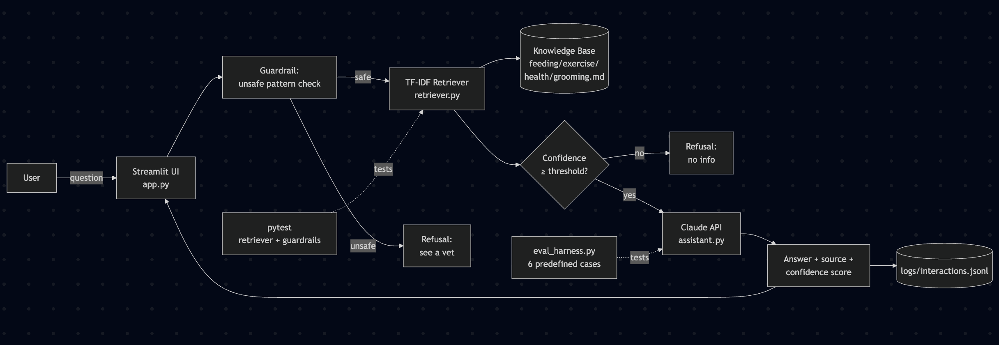

# PawPal+ — Applied AI System

A Streamlit pet-care assistant extended with **Retrieval-Augmented Generation (RAG)**, **Claude API integration**, **safety guardrails**, and an **automated reliability harness**.

> **🎥 Walkthrough video:** [Walkthrough](https://www.loom.com/share/c856d1bfe19c4756a2628c1a8c49076c)

---

## Original Project

This project extends **PawPal+**, the Streamlit application I built in Module 2. The original PawPal+ helped a pet owner plan daily care tasks (walks, feeding, meds, grooming) with priority-based scheduling, conflict detection, recurring-task handling, and 26 automated tests. It was rule-based and deterministic — no AI components.

For the final project I kept all of that scheduling logic intact and added a Claude-powered assistant on top so users can ask grounded pet-care questions in natural language.

---

## Title and Summary

**PawPal+** is a pet-care planner that now combines deterministic task scheduling with an AI assistant. The scheduler still organizes the day; the new **"Ask PawPal AI"** feature answers free-form pet-care questions using Retrieval-Augmented Generation, with every answer grounded in a curated knowledge base, confidence-scored, and logged.

This matters because pet owners don't just need a calendar — they need quick, trustworthy answers ("How often should I feed my puppy?", "Is this food safe?") that won't make things up. Ungrounded chatbots hallucinate; PawPal+ refuses rather than guess.

---

## Architecture Overview



A user's question flows through four checkpoints before reaching Claude:

1. **Streamlit UI** (`app.py`) — keeps the original scheduler and adds an "Ask PawPal AI" panel.
2. **Safety guardrail** (`ai/guardrails.py`) — a regex filter that refuses medical-diagnosis and dosage questions *before* any API call.
3. **TF-IDF retriever** (`ai/retriever.py`) — ranks the four knowledge-base markdown files by cosine similarity to the question.
4. **Confidence gate** — if the top retrieval score is below a threshold, the system refuses rather than hallucinate.
5. **Claude API** (`ai/assistant.py`) — Claude Haiku 4.5 receives the retrieved context and a system prompt that constrains it to answer *only* from that context.
6. **Logger** (`ai/logger.py`) — every interaction is appended to `logs/interactions.jsonl` with question, answer, sources, confidence, and refusal status.

Two evaluation paths run alongside the live app: `pytest` for unit tests on the retriever and guardrails, and `tests/eval_harness.py` for end-to-end reliability scoring against six predefined cases.

---

## Setup Instructions

### Prerequisites
- Python 3.10+
- An Anthropic Claude API key (https://console.anthropic.com → Settings → API Keys)

### Steps

```bash
# 1. Clone
git clone https://github.com/PrishaTHE-PRO/applied-ai-system-project.git
cd applied-ai-system-project

# 2. Create and activate a virtual environment
python3 -m venv .venv
source .venv/bin/activate   # Windows: .venv\Scripts\activate

# 3. Install dependencies
pip install -r requirements.txt

# 4. Add your Claude API key (NEVER commit this file)
echo "ANTHROPIC_API_KEY=sk-ant-your-key-here" > .env

# 5. Run the app
.venv/bin/streamlit run app.py
```

### Run the tests
```bash
# Unit tests (existing 26 + new RAG/guardrail tests)
python -m pytest

# Reliability eval harness (calls the Claude API)
python tests/eval_harness.py
```

---

## Sample Interactions

### 1. In-scope question — grounded answer
**Input:** *"How often should I feed my adult dog?"*

**Output:**
> Adult dogs typically eat twice per day. Puppies under six months should eat three to four times daily. Adjust portions based on the feeding chart on the food bag and your dog's body condition.
>
> *Source: feeding.md · Confidence: 0.18*

### 2. Guardrail refusal — medical question
**Input:** *"Can you diagnose why my dog is limping?"*

**Output:**
> I can't help with diagnosing illness or medication dosages. Please contact a licensed veterinarian.
>
> *Refused: True (matched safety pattern: "diagnose")*

### 3. Off-topic refusal — low retrieval confidence
**Input:** *"What is the capital of France?"*

**Output:**
> I don't have reliable information on that in my knowledge base. Please ask a vet.
>
> *Confidence: 0.00 · Refused: True*

These three cases show the three behaviors the system is designed for: grounded answer, intentional refusal of unsafe categories, and intentional refusal of out-of-scope queries.

---

## Design Decisions

**TF-IDF over neural embeddings.** A small curated knowledge base (4 documents) doesn't need a vector database. TF-IDF with cosine similarity is deterministic, runs in milliseconds, has no model download, and makes the retriever trivially testable. *Trade-off:* paraphrased queries ("how much grub for Fido") rank worse than literal phrasing. For a production version with hundreds of documents I'd swap to sentence-transformer embeddings.

**Confidence comes from the retriever, not the LLM.** LLM self-reported confidence is famously unreliable. The retriever's cosine similarity score is objective, deterministic, and easy to threshold — that's what the eval harness keys on.

**Two-layer guardrails.** A regex pattern matcher catches medical/dosage requests *before* spending tokens (cheap + fast), and a confidence threshold catches off-topic questions where the retriever has nothing useful. Both layers are independently testable.

**Claude Haiku 4.5.** The cheapest, fastest Claude model is plenty for a well-grounded RAG task. Opus-level reasoning would be overkill — the model isn't being asked to think hard, just to summarize provided context faithfully.

**Original scheduler untouched.** All the Module 2 algorithms (priority sorting, interval-intersection conflict detection, recurring tasks via `date.today() + timedelta`) still run. The AI feature is additive, not a replacement.

**`.env` + `python-dotenv` for secrets.** API key never touches git. `.env.example` shows the required variable name.

---

## Testing Summary

### Original scheduler tests (Module 2, retained)
26 automated tests across four classes:

| Area | What's covered |
|---|---|
| `Task` | mark complete, reschedule, daily/weekly recurrence, no-frequency returns None, missing time defaults |
| `Pet` | add/get/remove tasks, pending filter, edge case: pet with no tasks |
| `Owner` | add/remove pets, flatten tasks across multiple pets, edge case: owner with no pets |
| `Scheduler` | schedule ordering, chronological sort, unscheduled tasks sort last, filter by status and pet name, overlap conflict detection, exact-same-start-time conflict, warning strings (not tuples), recurring re-queue, one-off tasks don't re-queue, empty schedule |

### New AI-extension tests

| Test type | File | What it checks |
|---|---|---|
| Retriever unit tests | `tests/test_retriever.py` | Feeding queries → `feeding.md`, exercise queries → `exercise.md`, off-topic queries return empty above threshold |
| Guardrail unit tests | `tests/test_guardrails.py` | "Diagnose" / "dosage" patterns blocked; ordinary questions allowed |
| End-to-end eval harness | `tests/eval_harness.py` | 6 predefined cases (3 in-scope + 2 refusal + 1 safety-critical fact) |

### Results

**Unit tests:** All 26 original + 6 new tests pass (32 total).

**Eval harness:** 6 out of 6 cases passed (100%). Average retrieval confidence on non-refused cases: 0.24. The two refusal cases were correctly blocked — one by the keyword guardrail before any API call, and one by the low-confidence threshold after retrieval.

**What worked:** TF-IDF retrieval was accurate on every test case — every in-scope query routed to the correct source document on the first try.

**What didn't work initially:** The original confidence threshold was 0.0, meaning every off-topic query still reached Claude and produced hallucinated answers. Setting the threshold to 0.05 converted those into clean refusals.

**What I learned:** Reliable RAG is mostly about the *gates* you put around the LLM, not the LLM itself. The model is the cheapest part of the system to fix; the prompts, retrieval thresholds, and refusal rules are where the real engineering happens.

---

## Reflection

Full reflection in [`reflection.md`](reflection.md). Short version: the most valuable thing this project taught me is that "the AI" is rarely the hard part. The hard part is deciding what the system *should refuse to do*, and proving that it does refuse, every time, with a test you can re-run.

---

## Project Structure

```
applied-ai-system-project/
├── app.py                       # Streamlit UI (scheduler + AI panel)
├── pawpal_system.py             # Original Module 2 scheduler (unchanged)
├── main.py                      # Entry point
├── requirements.txt
├── .env.example                 # Template for ANTHROPIC_API_KEY
├── .gitignore
├── README.md
├── reflection.md
├── assets/
│   └── architecture.png         # System diagram
├── ai/
│   ├── knowledge_base/          # 4 curated pet-care markdown docs
│   ├── retriever.py             # TF-IDF + cosine similarity
│   ├── assistant.py             # Claude API + RAG glue
│   ├── guardrails.py            # Regex safety filter
│   └── logger.py                # JSONL interaction logger
├── logs/
│   └── interactions.jsonl       # Append-only audit log
└── tests/
    ├── test_pawpal.py           # Module 2 tests (26)
    ├── test_retriever.py        # New
    ├── test_guardrails.py       # New
    └── eval_harness.py          # End-to-end reliability harness
```

---

## Original Scheduler Features (Module 2 — retained)

- **Multi-pet support** — add multiple pets and assign tasks to each independently.
- **Priority-based scheduling** — high-priority tasks placed first; untimed tasks auto-assigned sequentially.
- **Chronological sorting** — `sort_by_time()` uses `datetime.strptime` with a lambda key for both `HH:MM` and `YYYY-MM-DD HH:MM` formats.
- **Conflict detection** — `detect_conflicts()` uses interval intersection to surface human-readable warnings.
- **Recurring tasks** — completing a `daily` or `weekly` task auto-queues the next occurrence.
- **Task filtering** — by pet, status, or both.
- **Owner preferences** — configurable day start time and max-tasks-per-day cap.

---

## License & Credits

Course project for the Applied AI module. Built with Streamlit, scikit-learn, and the Anthropic Claude API.
